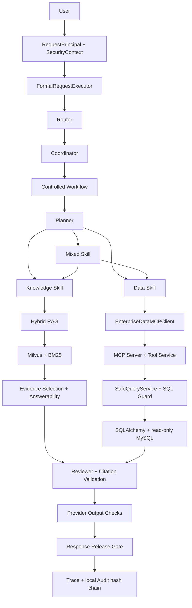

# Enterprise Decision Agent

> A controlled enterprise decision Agent integrating LangGraph orchestration, Hybrid RAG and MCP/MySQL under explicit evidence, citation, security and release boundaries.


Enterprise Decision Agent handles enterprise knowledge questions, read-only operational analysis and mixed decision scenarios. It is not a general chatbot: every request crosses explicit identity, scope, workflow, evidence, review and response-release boundaries before an answer can leave the runtime.

| Reproducible public repository evidence | Result |
| --- | ---: |
| Unit tests | 1,802 passed |
| Stable offline integration tests | 235 passed |
| Deterministic security cases | 28 / 28 |
| Frozen retrieval benchmark | 50 queries |

```text
Controlled orchestration  Router -> Planner -> Skill -> Evidence -> Reviewer -> Release
Hybrid RAG                Dense + BM25 -> Scope -> RRF -> Reranker -> Parent -> Evidence
Controlled data path      MCP -> DataScope -> SQL Guard -> read-only MySQL
Security and audit        Principal -> Scope -> ProviderPolicy -> Release Gate -> Audit
```

## Overview

The runtime composes a controlled Router–Planner–Executor–Reviewer workflow. Knowledge requests use scoped hybrid retrieval; data requests cross an MCP tool boundary into an allowlisted, bounded, read-only query service; mixed requests combine both paths without granting either path broader authority. Answers are released only after evidence, citation, output and audit checks succeed.

The project is intentionally not presented as a free autonomous multi-agent system. Planning and tool use operate inside closed schemas, fixed stage allowlists, immutable security context and explicit execution budgets.

## Architecture



The nine `ProviderStage` values—`routing`, `planning`, `data_planning`, `data_answer`, `evidence_selection`, `answerability_review`, `knowledge_answer`, `inventory_synthesis` and `workflow_review`—form a closed allowlist and execution-budget boundary. They do not mean every request makes nine model calls.

See [Architecture](docs/ARCHITECTURE.md) and [Agent Workflow](docs/AGENT_WORKFLOW.md).

## Key Engineering Capabilities

### Controlled Agent Orchestration

Routing, planning, skill dispatch, evidence selection, review and release are explicit runtime stages. Planner output cannot create permissions, enlarge scopes or bypass the registered skill and tool boundaries.

### Hybrid RAG

Dense retrieval and BM25 are filtered by `KnowledgeScope`, fused through RRF, reranked by a Cross-Encoder and expanded to parent chunks before evidence selection and citation. The frozen 50-query engineering benchmark improved Child Hit@1 from 84.78% to 93.48% and MRR@5 from 91.67% to 96.74%.

### Controlled Data Agent

Structured-data requests cross an MCP boundary and are validated by `DataScope`, safe projection and SQL Guard before reaching a read-only MySQL connection. The model does not receive unrestricted database access and does not directly execute arbitrary generated SQL.

### Security and Audit

Authorization is repeated at request, workflow, skill, tool, data, knowledge and provider boundaries. Required context or authorization failures are fail-closed. Response release requires a completed, cited result and a durable allowed audit event. The audit implementation is a single-process, local-file verifiable hash chain—not a distributed or hostile-writer guarantee.

## Hybrid RAG

```text
Dense Retrieval + BM25
          -> KnowledgeScope Filter
          -> RRF Fusion
          -> Cross-Encoder Reranker
          -> Parent Expansion
          -> Evidence Context
          -> Evidence Selection
          -> Citation
```

- Embedding: `BAAI/bge-small-zh-v1.5`, 512 dimensions
- Reranker: `BAAI/bge-reranker-base`
- Chunking baseline: `fixed-window-v1`
- Runtime vector store: Milvus; sparse retrieval: BM25

The benchmark is a frozen 50-query engineering retrieval benchmark, not a production accuracy claim. Details and reproducible hashes are in [Hybrid RAG](docs/HYBRID_RAG.md) and `artifacts/public-evaluation/`.

## Controlled Data Agent

```text
Data Skill
  -> EnterpriseDataMCPClient
  -> MCP Server
  -> EnterpriseDataToolService
  -> SafeQueryService
  -> SQL Guard
  -> SQLAlchemy
  -> read-only MySQL
```

SQL Guard permits one parsed read-only query, validates allowlisted tables and columns, rejects unsafe constructs, applies a bounded `LIMIT`, and returns accessed-table identities for scope verification. See [Data Agent and MCP](docs/DATA_AGENT_AND_MCP.md).

## Security Boundaries

The formal path carries `RequestPrincipal`, `SecurityContext`, tenant/session bindings, scenario/workflow/skill/tool authorization, `DataScope`, `KnowledgeScope`, `ProviderPolicy`, recursive redaction, response-release checks and payload-free `AuditEvent` records. See [Security Boundaries](docs/SECURITY_BOUNDARIES.md).

## Engineering Evidence

The protected-main workflow defines exactly six checks: `quality`, `unit`, `security-evaluation`, `secret-scan`, `dependency-scan` and `offline-integration`. The Unit and offline-integration counts above are directly reproducible from this public repository; they are test counts, not coverage percentages.

## Evaluation

### Retrieval benchmark

| Frozen 50-query benchmark | RRF Child | Cross-Encoder Child | Change |
| --- | ---: | ---: | ---: |
| Hit@1 | 84.78% | 93.48% | +8.70 percentage points |
| MRR@5 | 91.67% | 96.74% | +5.07 percentage points |
| Hit@5 | 100% | 100% | — |

The set contains 46 answerable and 4 unanswerable queries.

### Frozen system run

| Frozen-run observed metric | Result |
| --- | ---: |
| Formal Runtime | 8 / 9 |
| Deterministic Boundaries | 4 / 4 |
| Overall | 12 / 13 |
| Unanswerable | 2 / 3 |
| False positives | 1 |
| Provider calls | 45 |
| Input / output tokens | 38,549 / 4,258 |
| End-to-end P50 / P95 | 9.594 s / 24.250 s |

These are frozen-run observed metrics from a small engineering evaluation, not production accuracy, cost or SLA measurements. See [Evaluation](docs/EVALUATION.md).

## Demo

The CLI exposes three fixed, server-owned cases; arbitrary caller text cannot enlarge their scopes:

```powershell
python scripts/initialize_knowledge_corpus.py
python scripts/run_local_demo.py knowledge
python scripts/run_local_demo.py data
python scripts/run_local_demo.py mixed
```

The initialization command reuses the formal Milvus ingestion path and does not call a Provider. Provider-backed answer generation requires the user to configure their own supported API credentials and may incur Provider cost. See [Local Demo](docs/LOCAL_DEMO.md).

## Project Structure

```text
src/decision_agent/       Runtime, security, retrieval, MCP, API and skills
tests/                    Unit, offline-integration and opt-in service tests
scripts/                  Corpus initialization, demo, evaluation and verification entrypoints
datasets/                 Synthetic knowledge, operations and security fixtures
docker/mysql/init/        Synthetic schema, seed and read-only user bootstrap
artifacts/evaluation/     Frozen sanitized engineering evidence
artifacts/public-evaluation/ Public provenance maps for the retained evidence
docs/                     Public architecture, operation and limitation guides
.github/                  CI and dependency update configuration
```

## Local Run

```powershell
python -m venv .venv
.\.venv\Scripts\python.exe -m pip install -r requirements.lock
.\.venv\Scripts\python.exe -m pip install -e . --no-deps
Copy-Item .env.example .env
docker compose config
docker compose up -d
.\.venv\Scripts\python.exe scripts\initialize_knowledge_corpus.py
.\.venv\Scripts\python.exe scripts\run_local_demo.py knowledge
.\.venv\Scripts\python.exe scripts\run_local_demo.py data
.\.venv\Scripts\python.exe scripts\run_local_demo.py mixed
```

The copied example is configuration-complete for local Docker, MySQL and Milvus bootstrap. Replace the three Provider placeholders with your own supported API configuration before running Provider-backed answers, and never commit the ignored `.env` file. For offline evidence verification without a Provider or models:

```powershell
.\.venv\Scripts\python.exe scripts\verify_retrieval_evidence.py
.\.venv\Scripts\python.exe scripts\calculate_m9_metrics.py artifacts\evaluation\m9-final-eval-v1\case_records.jsonl --dataset datasets\agent_tasks\m9_final_eval_v1.json --adjudications artifacts\evaluation\m9-final-eval-v1\adjudications.json --output $env:TEMP\m9-metrics.json --manifest-output $env:TEMP\m9-manifest.json
```

## Known Limitations

The frozen evaluation intentionally retains one real false-positive case: `m9-knowledge-unanswerable-003`. An unanswerable knowledge request was released with citations. This is an Answerability/evidence-sufficiency failure; it is not an authorization bypass or sensitive-data leak. The case remains in the benchmark rather than being removed or reclassified.

The project does not claim autonomous multi-agent collaboration, Neo4j/GraphRAG, Langfuse, RAGAS, Kubernetes, production high concurrency, a production SLA or a distributed tamper-proof audit system. See [Limitations](docs/LIMITATIONS.md).

## Scope

This repository is a stable, v1.0.2-based public snapshot. It preserves the frozen Agent runtime and evaluation evidence while adding only public-release documentation, local configuration and corpus-initialization utilities. No project-level open-source license is currently granted.
