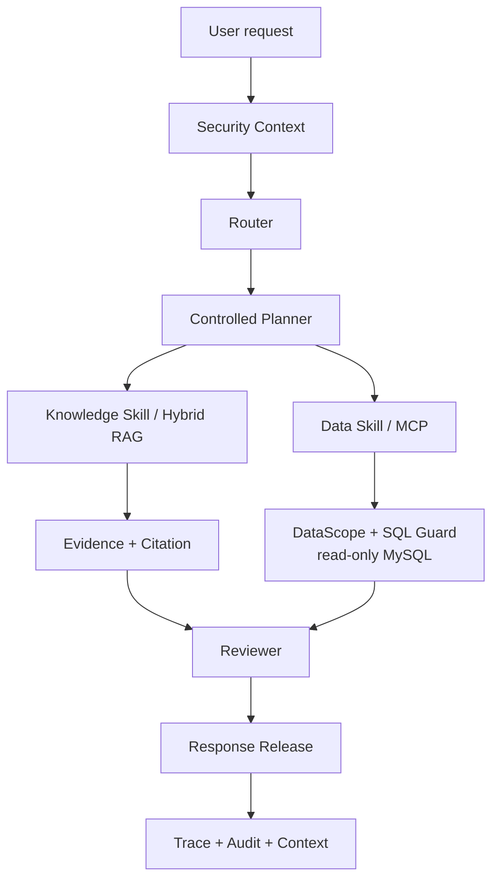
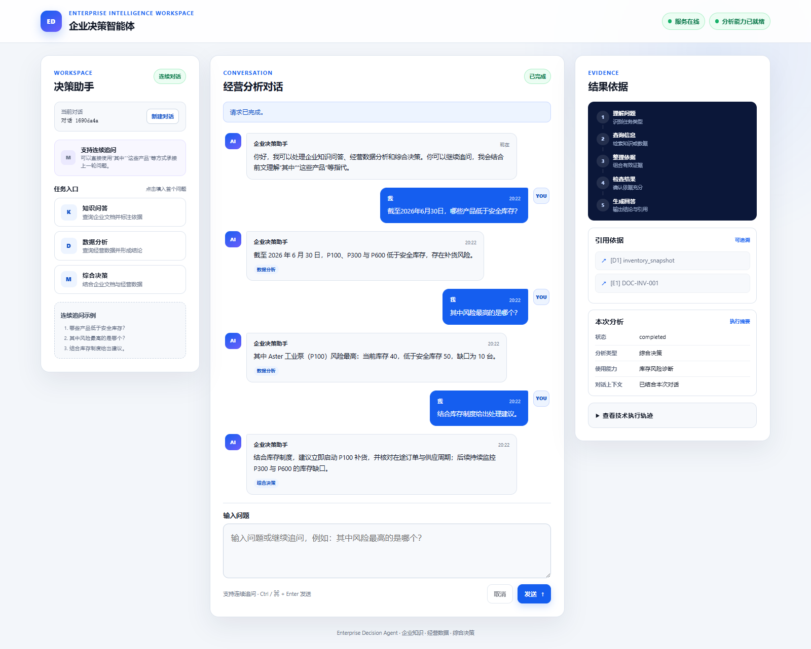

# Enterprise Decision Agent

> **受控 Knowledge + Data AI Agent Platform**

[](https://github.com/ccy777/enterprise-decision-agent/actions/workflows/ci.yml)


这是一个 evidence-first AI Agent 平台：它在 Hybrid RAG 与只读数据工具之间路由企业问题，只有通过 Scope、Evidence、Citation 和 Reviewer 检查后才会发布回答。

面向企业知识问答、经营数据分析与综合决策场景，统一编排 Agentic RAG、MCP Data Agent、Context / Memory 与结果审查。

## 核心亮点 (Highlights)

- 以受控 `Router -> Planner -> Skill -> Reviewer -> Release` workflow 替代不受限的 Tool Calling。
- 通过 Knowledge、Data、Mixed 三类路由处理制度问答、只读分析与基于证据的建议。
- Hybrid RAG：Dense + BM25 -> RRF -> Cross-Encoder -> Parent Expansion。
- 基于 MCP 的只读企业数据访问，结合 DataScope、safe projection、SQL validation、LIMIT 与 timeout。
- 在 Response Release 前完成 Evidence Selection、Answerability 和 Citation validation。
- 当必要授权缺失时，SecurityContext 与 Scope 边界按 fail-closed 原则拒绝请求。
- 采用已冻结/正式采用的 200-query Retrieval Benchmark v2，并保留可复现的 ranking evidence。
- CI 覆盖 quality、tests、security evaluation、secret scan、dependency scan 与 offline integration。

## 为什么它不是普通 RAG Demo

| 路径 | Agent 执行内容 | 控制边界 |
| --- | --- | --- |
| **Knowledge** | Hybrid retrieval、Evidence Selection、Answerability 与 Citation | KnowledgeScope 和 evidence review |
| **Data** | MCP Tool invocation 与只读业务数据分析 | DataScope、SQLGlot validation、safe projection、SQL Guard |
| **Mixed** | 将制度 Evidence 与业务 Data 组合为决策建议 | Reviewer 在 controlled release 前检查 evidence sufficiency |

因此，这不是简单的 `Question -> Vector DB -> LLM`：每个回答都有明确的 route、已授权 capability、evidence basis、review step 与 release decision。

## Architecture（架构）



公开架构有意展示控制链，而不展开内部 Provider stage 或部署细节。具体设计见 [Architecture](docs/ARCHITECTURE.md) 与 [Agent Workflow](docs/AGENT_WORKFLOW.md)。



> 内置 FastAPI Demo UI 会展示 runtime readiness、answers、citations、route、selected skill、memory state 与 execution trace。截图刻意展示未配置 Provider 时的 unready runtime：系统会 fail-closed，而不是伪造 ready 状态。

## 核心能力 (Core Features)

### 1. Controlled Agent Workflow（受控 Agent 工作流）

LangGraph 编排显式的 Router、Planner、Skill、Reviewer 与 Release stages。一个 plan 不能创建 privilege、扩大 Scope，或绕过已注册的 tools 和 skills；这是受控执行，而不是任意 Agent-to-tool access。

### 2. Agentic RAG

```text
Dense + BM25 -> RRF -> Cross-Encoder -> Parent Expansion
                              -> Evidence Selection -> Citation
```

检索链同时使用 semantic 与 lexical recall，对融合候选进行 reranking，扩展相关 Parent context，并区分 candidate evidence 与可发布的 Citation。系统支持 Answerability review，不宣称消除 hallucination。详见 [Hybrid RAG](docs/HYBRID_RAG.md)。

### 3. MCP Data Agent

Data 请求需跨越 MCP Tool boundary，并受只读 SQL、table / column allowlist、`LIMIT`、timeout、DataScope 与 safe data projection 约束。模型只能看到该请求被允许暴露的字段。详见 [Data Agent & MCP](docs/DATA_AGENT_AND_MCP.md)。

### 4. Context / Memory

Context / Memory 按 tenant、user、session 做有界隔离。runtime 支持 in-memory 或 Redis-backed state、TTL、state version、rolling summary 与 bounded context，而不是无限累积会话内容。

### 5. Security & Review（安全与审查）

SecurityContext 与 Scope checks 覆盖 request、workflow、skill、tool、data、knowledge 和 Response Release 边界；缺少授权时默认 fail-closed。Evidence validation、Reviewer、release gate 与本地可验证 Audit hash chain 共同让决策路径可审查。详见 [Security Boundaries](docs/SECURITY_BOUNDARIES.md)。

## Retrieval Benchmark v2

**状态：FROZEN / ADOPTED。** Retrieval Benchmark v2 是本项目当前公开 Benchmark。

| 组成 | 数值 |
| --- | ---: |
| Queries | 200 |
| Answerable / Unanswerable | 160 / 40 |
| Enterprise documents | 12 |
| Parent records | 36 |
| Child evidence windows | 101 |

ranking metrics 以 **160 Answerable queries** 为 denominator；40 个 Unanswerable queries 被明确排除在 Hit@K 与 MRR denominator 之外。

| 指标 | RRF | Cross-Encoder Reranker | 增益 |
| --- | ---: | ---: | ---: |
| Child Hit@1 | 85.62% | 96.25% | +10.63pp |
| Hit@5 | 100.00% | 100.00% | — |
| MRR@5 | 91.69% | 98.12% | +6.44pp |

relevance freeze 区分 single-window answer sufficiency 与 multi-evidence retrieval relevance。Cross-Encoder reranking 显著提升前排 Evidence relevance；但 multi-evidence evaluation 也揭示了真实的 precision–coverage trade-off：将 Top-K 过度集中于最相似 Evidence，可能降低 evidence diversity 与 full evidence coverage。因此不能声称 reranking 改善所有 retrieval objective。

### Historical v1 Baseline

原 50-query 结果保留为 **Historical Baseline**，而非当前 Benchmark：46 Answerable / 4 Unanswerable queries，RRF Child Hit@1 为 **84.78%**，Cross-Encoder Child Hit@1 为 **93.48%**。当前参考口径以上述 Retrieval Benchmark v2 为准。

> 这些结果来自 frozen synthetic-enterprise benchmark，不是 production accuracy、production SLA、通用现实场景表现，也不代表该 benchmark 之外的 100% retrieval quality。

## 工程质量 (Engineering Quality)

项目强调可验证的工程证据，而不是不断变化的测试数量。

- GitHub Actions 对每个 Pull Request 执行 `quality`、`unit`、`security-evaluation`、`secret-scan`、`dependency-scan` 与 `offline-integration`。
- Offline verification 与 selected tests 不需要 Provider、外部数据库或网络服务。
- Retrieval evidence 使用 committed verifier 检查，而非重新运行高成本 model evaluation。
- dependency scanning 是 CI 强制门禁：vulnerability 会在 merge 前被阻断，而不是在发布后才记录。
- secret scanning 与 fail-closed security evaluation 是一等交付门禁。

## Demo / 运行

### Quick Verify — 无需 Provider

安装 locked environment 后运行仓库提交的 retrieval-evidence verifier。该操作只检查 public-safe committed evidence，不调用 Provider。

```powershell
python -m venv .venv
.\.venv\Scripts\python.exe -m pip install -r requirements.lock
.\.venv\Scripts\python.exe -m pip install -e . --no-deps
.\.venv\Scripts\python.exe scripts\verify_retrieval_evidence.py
```

### Full Demo — 使用自己的本地配置

请参阅 [Local Demo](docs/LOCAL_DEMO.md) 以及 [`.env.example`](.env.example) 中的字段说明，配置自己的 compatible Provider 与本地基础设施。仓库不包含可用 credentials、model weights、database volume 或 runtime audit log。

```powershell
docker compose config
docker compose up -d

.\.venv\Scripts\python.exe scripts\run_local_demo.py knowledge
.\.venv\Scripts\python.exe scripts\run_local_demo.py data
.\.venv\Scripts\python.exe scripts\run_local_demo.py mixed
```

三种模式分别演示 Knowledge、Data 和 Mixed 路径。Provider calls 可能产生费用；前置条件与停止步骤见 Local Demo guide。若要查看 UI，请运行：

```powershell
.\.venv\Scripts\python.exe -m uvicorn decision_agent.main:app --host 127.0.0.1 --port 8000
```

然后访问 `http://127.0.0.1:8000`。

## 项目结构 (Project Structure)

```text
src/decision_agent/   Agent runtime、security、retrieval、MCP、API 与 skills
tests/                Unit 与 offline integration tests
scripts/              Demo 与 committed verification entry points
datasets/             Sanitized synthetic knowledge、data 与 security fixtures
docs/                 Public architecture、workflow、security 与 demo guides
.github/              CI 与 dependency automation
```

## 文档导航 (Documentation)

| 文档 | 内容 |
| --- | --- |
| [Architecture](docs/ARCHITECTURE.md) | 系统层次与端到端 request flow |
| [Agent Workflow](docs/AGENT_WORKFLOW.md) | Router、Planner、Skills、Reviewer 与 release controls |
| [Hybrid RAG](docs/HYBRID_RAG.md) | Retrieval、fusion、reranking、Parent Expansion 与 Evidence Selection |
| [Data Agent & MCP](docs/DATA_AGENT_AND_MCP.md) | MCP、DataScope、SQL Guard 与只读数据访问 |
| [Security Boundaries](docs/SECURITY_BOUNDARIES.md) | Identity、authorization、scope、provider 与 audit boundaries |
| [Local Demo](docs/LOCAL_DEMO.md) | 本地前置条件与 Knowledge / Data / Mixed walkthrough |
| [Limitations](docs/LIMITATIONS.md) | 已知约束与工程边界 |

## 范围与限制 (Scope and Limitations)

这是一个受控工程系统，不宣称 unrestricted autonomy、zero hallucinations 或 production-scale guarantees。公开文档仅展示 architecture、sanitized demonstrations、benchmark composition 与 verified metrics；不会公开 credentials、private configurations、raw benchmark artifacts、original query sets、internal adjudications、runtime logs 或 internal filesystem paths。

仓库当前没有 project-wide open-source license。公开可见不等同于自动允许复制、修改或再分发代码。
