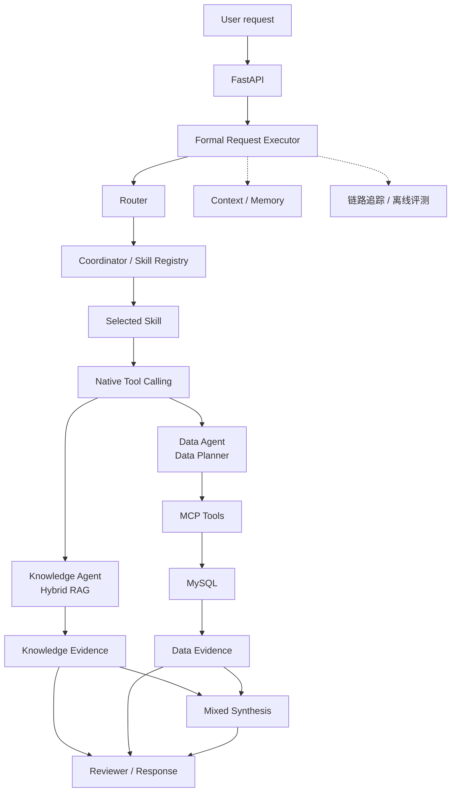

# 企业决策智能体

> **面向企业知识与经营数据的 AI Agent 平台**

[](https://github.com/ccy777/enterprise-decision-agent/actions/workflows/ci.yml)


这是一个面向企业知识问答、经营数据分析与库存风险诊断的 AI Agent 平台。系统通过 Router 识别 `Knowledge`、`Data` 与 `Mixed` 三类任务，并由对应 Skill 完成知识检索、数据查询或知识与数据联合决策。

项目基于LangGraph编排Agent工作流，集成Hybrid RAG、MCP数据智能体、上下文记忆、Tool Calling、Trace与离线评测，并通过FastAPI提供统一服务接口。

## 真实运行界面


### 知识与数据联合决策


同一次请求由 Router 选择 `mixed`，执行 `inventory-risk-diagnosis`，回答同时包含数据引用 `[D1]` 与知识引用 `[E1]`、`[E2]`。

### 执行链追踪


Trace 展示 routing、planning、MCP Tool Calling、Knowledge retrieval、evidence selection、review 与 answer generation；公开投影不展示 Prompt、SQL、业务记录、Evidence/Audit 正文或凭据。

### 越权请求阻断


该请求触发`data_scope_denied`，系统在外部调用前完成识别，Provider调用和Tool调用均为0。

## 核心能力

- **工作流与提示词工程**：基于 LangGraph 编排 `Router -> Planner -> Skill -> Tool -> Reviewer` 多步骤工作流，通过 Prompt 与 Pydantic 结构化输出约束阶段输入输出。
- **上下文与会话记忆**：支持 Redis / In-Memory 会话状态、TTL、滚动摘要与上下文预算，按租户、用户和会话隔离多轮任务。
- **混合检索与离线评测**：采用 `Dense + BM25 -> RRF -> Cross-Encoder -> Parent Expansion` 检索链，并通过 200 条企业场景查询验证排序效果。
- **MCP 数据智能体与工具调用**：通过 Native Tool Calling 选择并执行 Data Agent，由 Data Planner 生成结构化 SQL 计划，再调用 MCP Tools 完成 Schema 获取、MySQL 查询与结果分析。
- **链路追踪与智能体评测**：记录路由、规划、Skill、MCP、Evidence 与 Reviewer 的阶段状态、错误码和耗时，并建立离线回归与边界评测。
- **三类任务路由**：统一处理企业知识问答、经营数据分析以及知识与数据联合决策。
- **数据访问与工程交付**：使用SQLGlot、DataScope、Evidence、Citation与Reviewer完成查询和结果校验，CI覆盖质量、测试和依赖检查。

## 为什么不是普通 RAG 项目

| 路径 | Agent 执行内容 | 典型输出 |
| --- | --- | --- |
| **Knowledge** | Hybrid retrieval、Evidence Selection、Answerability 与 Citation | 带文档依据的企业知识回答 |
| **Data** | Data Planner、Tool Calling、MCP Tool 与 MySQL 数据分析 | 结构化查询结果与经营数据结论 |
| **Mixed** | 将 Knowledge Evidence 与 Data Evidence 组合并交由 Reviewer 检查 | 同时引用制度与业务数据的决策建议 |

因此，这不是简单的 `Question -> Vector DB -> LLM`：系统会先判断任务类型，再执行相应 Skill 和 Tool，并基于知识或数据 Evidence 生成结果。

## 整体架构



上图展示项目主执行链，完整的模块职责和请求流程见[整体架构](docs/ARCHITECTURE.md)与[智能体工作流](docs/AGENT_WORKFLOW.md)。


> 内置FastAPI网页界面会展示运行状态、回答、引用、路由、Skill、会话记忆和执行链。截图展示了未配置模型服务时的就绪状态，便于检查本地依赖配置。

## 核心模块

### 1. 工作流与提示词工程

LangGraph负责编排Router、Planner、Skill、Tool和Reviewer。各阶段使用独立Prompt和Pydantic结构化输出，条件分支与状态对象负责串联知识问答、数据分析和异常处理。

### 2. 混合检索（Hybrid RAG）

```text
Dense + BM25 -> RRF -> Cross-Encoder -> Parent Expansion
                              -> Evidence Selection -> Citation
```

检索链同时使用语义召回与关键词召回，对融合候选进行精排并扩展Parent上下文，随后完成Evidence Selection、Answerability Review和Citation校验。详见[混合检索](docs/HYBRID_RAG.md)。

### 3. MCP 数据智能体与工具调用

Native Tool Calling 根据已选路由调用 `run_data_agent`；Data Agent 通过 MCP 获取 Schema 与业务定义，由 Data Planner 将自然语言问题转换为结构化 SQL 计划，再调用 MCP Tool 完成 MySQL 查询与结果分析。查询链使用 SQLGlot、table / column allowlist、`LIMIT`、timeout 与 DataScope 约束查询范围。详见 [Data Agent & MCP](docs/DATA_AGENT_AND_MCP.md)。

### 4. 上下文与会话记忆

Context / Memory 按 tenant、user、session 做有界隔离。runtime 支持 in-memory 或 Redis-backed state、TTL、state version、rolling summary 与 bounded context，而不是无限累积会话内容。

### 5. 链路追踪与智能体评测

系统为路由、规划、Skill、Tool Calling、检索、Evidence和Reviewer建立请求级Trace，记录阶段状态、错误码和耗时。离线验证覆盖稳定集成测试、边界评测和可独立复算的检索Benchmark，详见[项目评测](docs/EVALUATION.md)。

### 6. 安全边界与结果审查

SecurityContext与Scope用于确定当前请求可访问的Skill、Tool、知识文档和业务数据；Evidence Validation、Reviewer、Citation和Audit共同记录并校验最终结果。详见[数据访问与结果校验](docs/SECURITY_BOUNDARIES.md)。

## 检索评测 v2

**状态：FROZEN / ADOPTED。** Retrieval Benchmark v2 是本项目当前公开 Benchmark。

| 组成 | 数值 |
| --- | ---: |
| Queries | 200 |
| Answerable / Unanswerable | 160 / 40 |
| Enterprise documents | 12 |
| Parent records | 36 |
| Child evidence windows | 101 |

ranking metrics 以 **160 Answerable queries** 为 denominator；40 个 Unanswerable queries 被明确排除在 Hit@K 与 MRR denominator 之外。

| 指标 | RRF | Cross-Encoder Reranker | 增益 |
| --- | ---: | ---: | ---: |
| Child Hit@1 | 85.62% | 96.25% | +10.63pp |
| Hit@5 | 100.00% | 100.00% | — |
| MRR@5 | 91.69% | 98.12% | +6.44pp |

完整公开证据包、冻结相关性集、排名记录和复核命令见 [Retrieval Benchmark v2 public evidence](artifacts/public-evaluation/retrieval-v2/README.md)。

相关性标注同时覆盖单一Evidence和多Evidence问题。Cross-Encoder显著提升前排结果质量，评测也记录了Top-K精度与Evidence覆盖率之间的变化，为后续参数优化提供依据。

### 历史 v1 基线

原 50-query 结果保留为 **Historical Baseline**，而非当前 Benchmark：46 Answerable / 4 Unanswerable queries，RRF Child Hit@1 为 **84.78%**，Cross-Encoder Child Hit@1 为 **93.48%**。当前参考口径以上述 Retrieval Benchmark v2 为准。

> 这些结果来自 frozen synthetic-enterprise benchmark，不是 production accuracy、production SLA、通用现实场景表现，也不代表该 benchmark 之外的 100% retrieval quality。

## 工程质量

项目强调可验证的工程证据，而不是不断变化的测试数量。

| 公开验证项 | 当前结果 |
| --- | ---: |
| 单元测试 | 1,802 项通过 |
| 稳定离线集成测试 | 235 项通过 |
| 确定性边界评测 | 28 / 28 通过 |

- GitHub Actions 对每个 Pull Request 执行 `quality`、`unit`、`security-evaluation`、`secret-scan`、`dependency-scan` 与 `offline-integration`。
- Offline verification 与 selected tests 不需要 Provider、外部数据库或网络服务。
- Retrieval evidence 使用 committed verifier 检查，而非重新运行高成本 model evaluation。
- dependency scanning 是 CI 强制门禁：vulnerability 会在 merge 前被阻断，而不是在发布后才记录。
- Secret Scan与安全评测均已纳入CI检查。

## 本地运行

### 快速验证——无需配置模型服务

安装 locked environment 后运行仓库提交的 Retrieval Benchmark v2 verifier。该操作从公开的冻结相关性集与排名记录重新计算简历使用的 Hit@1 / MRR@5，不加载模型，也不调用 Provider。

```powershell
python -m venv .venv
.\.venv\Scripts\python.exe -m pip install -r requirements.lock
.\.venv\Scripts\python.exe -m pip install -e . --no-deps
.\.venv\Scripts\python.exe scripts\verify_retrieval_v2_evidence.py
```

### 完整演示——使用本地配置

请参阅[本地运行指南](docs/LOCAL_DEMO.md)和[`.env.example`](.env.example)，配置模型服务与本地基础设施。

```powershell
docker compose config
docker compose up -d

.\.venv\Scripts\python.exe scripts\run_local_demo.py knowledge
.\.venv\Scripts\python.exe scripts\run_local_demo.py data
.\.venv\Scripts\python.exe scripts\run_local_demo.py mixed
.\.venv\Scripts\python.exe scripts\run_local_web_demo.py mixed
```

前三种模式分别演示Knowledge、Data和Mixed命令行链路；最后一条启动本地网页演示。模型调用可能产生费用，配置和停止步骤见[本地运行指南](docs/LOCAL_DEMO.md)。

正式ASGI入口：

```powershell
.\.venv\Scripts\python.exe -m uvicorn decision_agent.main:app --host 127.0.0.1 --port 8000
```

然后访问 `http://127.0.0.1:8000`。

## 项目结构

```text
src/decision_agent/   Agent runtime、security、retrieval、MCP、API 与 skills
tests/                Unit 与 offline integration tests
scripts/              Demo 与 committed verification entry points
datasets/             Sanitized synthetic knowledge、data 与 security fixtures
docs/                 Public architecture、workflow、security 与 demo guides
.github/              CI 与 dependency automation
```

## 文档导航

| 文档 | 内容 |
| --- | --- |
| [整体架构](docs/ARCHITECTURE.md) | 系统模块与端到端请求流程 |
| [智能体工作流](docs/AGENT_WORKFLOW.md) | Router、Planner、Skill、Tool与Reviewer |
| [混合检索](docs/HYBRID_RAG.md) | 召回、融合、精排、Parent Expansion与Evidence Selection |
| [MCP数据智能体](docs/DATA_AGENT_AND_MCP.md) | MCP、Data Planner、SQL生成与MySQL查询 |
| [数据访问与结果校验](docs/SECURITY_BOUNDARIES.md) | Scope、SQL Guard、Reviewer与Audit |
| [本地运行指南](docs/LOCAL_DEMO.md) | Knowledge、Data与Mixed本地演示 |
| [项目状态与后续计划](docs/LIMITATIONS.md) | 已完成能力、当前评测和后续方向 |

## 项目状态

Knowledge、Data与Mixed三条链路，以及Hybrid RAG、MCP数据查询、Context / Memory、Trace和离线评测均已完成。后续计划包括扩充多轮任务评测、优化Answerability、增加性能压测，并接入更多MCP数据源和业务Skill。

公开仓库提供检索评测数据、排名记录和复核脚本。如需复制、修改或二次发布，请先联系作者。
