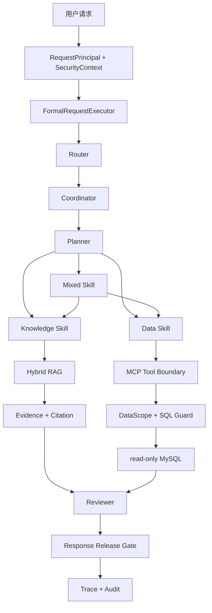

# 企业决策 Agent（Enterprise Decision Agent）

> 面向企业知识问答、只读经营数据分析与综合决策场景的受控 AI Agent。

[](https://github.com/ccy777/enterprise-decision-agent/actions/workflows/ci.yml)


它不是一个“接上大模型就回答”的普通聊天机器人。系统会在回答发布前依次处理身份与权限、路由、规划、知识或数据取证、证据筛选、答案审查、引用校验和发布控制，让每个结论都能说明：**用了什么能力、依据来自哪里、为什么允许返回。**

| 可复现的公开工程证据 | 结果 |
| --- | ---: |
| Unit Tests | **1,802 passed** |
| Stable Offline Integration | **235 passed** |
| Deterministic Security Cases | **28 / 28** |
| Frozen Retrieval Benchmark | **50 queries** |


> 仓库内置的 FastAPI Demo UI。图中未配置正式 Provider，因此 Runtime 按 fail-closed 规则如实显示“未就绪”；完成本地配置后，页面会展示回答、引用、路由、Skill、Memory 状态和执行轨迹。

## 这个项目解决什么问题

企业问答真正困难的部分通常不是“生成一段文字”，而是同时处理三类边界：

| 场景 | 典型问题 | 系统处理方式 |
| --- | --- | --- |
| 企业知识问答 | 保修、采购、库存制度是什么？ | 在授权文档内检索、筛选证据并生成引用 |
| 经营数据分析 | 哪些产品低于安全库存？ | 经 MCP、DataScope 和 SQL Guard 查询只读 MySQL |
| 综合决策分析 | 结合库存数据与补货制度给出建议 | 区分数据事实和制度依据，再统一审查后发布 |

系统的核心目标不是追求“自由行动”，而是让 Agent 在明确权限和证据边界内完成可追踪的企业任务。

## 代表性结果：冻结真实运行记录

下面不是手写示例，而是冻结 M9 `real_runtime` 记录 `m9-knowledge-fact-001` 的可公开字段。问题来自[冻结数据集](datasets/agent_tasks/m9_final_eval_v1.json)，执行结果来自[脱敏 Case Record](artifacts/evaluation/m9-final-eval-v1/case_records.jsonl)：

```yaml
case_id: m9-knowledge-fact-001
question: 产品 B 整机的基础保修期是多少？
execution_mode: real_runtime
route: knowledge
final_status: completed
security_decision: allowed
evidence_types: [document]
citation_count: 1
checks:
  facts: true
  answerability: true
  citations: true
passed: true
```

公开 Artifact 保留路由、证据类型、引用数量和逐项检查结果，不保留 Provider 回答正文；README 不补造未公开的答案。冻结证据可通过 `python scripts/calculate_m9_metrics.py ...` 离线复算，全程不会重新调用 Provider。

## 一张图看懂架构



主链可以概括为：

```text
Router -> Planner -> Skill -> Evidence -> Reviewer -> Release
```

详细设计见 [系统架构](docs/ARCHITECTURE.md) 和 [Agent 工作流](docs/AGENT_WORKFLOW.md)。

## 四个核心工程能力

### 1. 受控 Agent 编排

路由、规划、Skill 调度、证据筛选、审查和发布都是显式阶段。Planner 的输出不能创建权限、扩大 Scope，也不能绕过已注册的 Skill 和 Tool。

系统定义了九个闭集 `ProviderStage`：`routing`、`planning`、`data_planning`、`data_answer`、`evidence_selection`、`answerability_review`、`knowledge_answer`、`inventory_synthesis` 和 `workflow_review`。它们构成调用白名单与预算边界，**不表示每个请求固定调用模型九次**。

### 2. Hybrid RAG

```text
Dense Retrieval + BM25
          -> KnowledgeScope Filter
          -> RRF Fusion
          -> Cross-Encoder Reranker
          -> Parent Expansion
          -> Evidence Context
          -> Evidence Selection
          -> Citation
```

- Embedding：`BAAI/bge-small-zh-v1.5`，512 dimensions
- Reranker：`BAAI/bge-reranker-base`
- Chunking baseline：`fixed-window-v1`
- Vector store：Milvus

冻结的 50-query 工程基准中，Cross-Encoder 将 Child Hit@1 从 **84.78%** 提升到 **93.48%**，MRR@5 从 **91.67%** 提升到 **96.74%**。

详细说明见 [Hybrid RAG](docs/HYBRID_RAG.md)。

### 3. Controlled Data Agent

数据请求必须跨越 MCP Tool 边界，并通过：

- `DataScope`：限制可访问的数据域和资源；
- Safe Projection：只暴露回答需要的安全字段；
- SQL Guard：校验只读语句、表、列、行数和超时；
- Read-only Account：数据库账号不具备写权限。

详细说明见 [Data Agent 与 MCP](docs/DATA_AGENT_AND_MCP.md)。

### 4. Fail-closed Security 与审计

安全检查重复存在于 Request、Workflow、Skill、Tool、Data、Knowledge、Provider 和 Response Release 边界。缺少必要身份、Scope 或授权时，请求默认失败关闭。

覆盖的正式对象包括：

```text
RequestPrincipal / SecurityContext / Tenant / Session
Scenario / Workflow / Skill / Tool authorization
DataScope / KnowledgeScope / ProviderPolicy
Recursive Redaction / Response Release Gate
AuditEvent / Audit Hash Chain
```

Audit 是**单进程、本地文件、可验证 Hash Chain**，不宣称分布式强一致、绝对不可篡改或商业级不可抵赖。

详细说明见 [安全边界](docs/SECURITY_BOUNDARIES.md)。

## 可验证的工程证据

### CI 工作流的六项检查

当前 [CI workflow](.github/workflows/ci.yml) 为 `main` 的 Pull Request 和 Push 定义以下六项检查；仓库当前未把它们描述为已启用的 GitHub branch-protection required checks：

```text
quality
unit
security-evaluation
secret-scan
dependency-scan
offline-integration
```

Unit 和 Offline Integration 的数字是测试数量，不是 Coverage 百分比。

### Retrieval 冻结基准

| 50-query benchmark | RRF Child | Cross-Encoder Child | 变化 |
| --- | ---: | ---: | ---: |
| Hit@1 | 84.78% | 93.48% | +8.70 percentage points |
| MRR@5 | 91.67% | 96.74% | +5.07 percentage points |
| Hit@5 | 100% | 100% | — |

数据集包含 46 个 answerable query 和 4 个 unanswerable query。这是合成文档上的冻结工程基准，不是生产准确率。

### M9 冻结系统运行

| Frozen-run observed metric | 结果 |
| --- | ---: |
| Formal Runtime | 8 / 9 |
| Deterministic Boundaries | 4 / 4 |
| Overall | 12 / 13 |
| Unanswerable | 2 / 3 |
| False Positive | 1 |
| Provider Calls | 45 |
| Input / Output Tokens | 38,549 / 4,258 |
| End-to-end P50 / P95 | 9.594 s / 24.250 s |

这些数字是小规模 frozen-run observed metrics，不是生产 SLA、生产成本或线上准确率。完整口径见 [评测说明](docs/EVALUATION.md)。

## 快速体验

### 方式 A：不需要 Provider，验证冻结证据

```powershell
python -m venv .venv
.\.venv\Scripts\python.exe -m pip install -r requirements.lock
.\.venv\Scripts\python.exe -m pip install -e . --no-deps

.\.venv\Scripts\python.exe scripts\verify_retrieval_evidence.py
.\.venv\Scripts\python.exe scripts\calculate_m9_metrics.py artifacts\evaluation\m9-final-eval-v1\case_records.jsonl --dataset datasets\agent_tasks\m9_final_eval_v1.json --adjudications artifacts\evaluation\m9-final-eval-v1\adjudications.json --output $env:TEMP\m9-metrics.json --manifest-output $env:TEMP\m9-manifest.json
```

### 方式 B：运行完整本地 Demo

```powershell
Copy-Item .env.example .env
docker compose config
docker compose up -d

.\.venv\Scripts\python.exe scripts\initialize_knowledge_corpus.py
.\.venv\Scripts\python.exe scripts\run_local_demo.py knowledge
.\.venv\Scripts\python.exe scripts\run_local_demo.py data
.\.venv\Scripts\python.exe scripts\run_local_demo.py mixed
```

如需打开截图中的 Web UI：

```powershell
.\.venv\Scripts\python.exe -m uvicorn decision_agent.main:app --host 127.0.0.1 --port 8000
```

然后访问 `http://127.0.0.1:8000`。

完整 Demo 需要用户在本地环境配置自己的兼容 Provider 凭据，可能产生 Provider 费用。仓库不包含可用凭据、模型权重、数据库 Volume 或运行时 Audit Log。详细步骤见 [本地 Demo](docs/LOCAL_DEMO.md)。

## 项目结构

```text
src/decision_agent/          Agent Runtime、Security、Retrieval、MCP、API 与 Skills
tests/                       Unit、Offline Integration 与可选服务测试
scripts/                     Demo、初始化、评测与离线验证入口
datasets/                    合成知识、经营数据与安全用例
docker/mysql/init/           合成 Schema、Seed 与只读用户初始化
artifacts/evaluation/        冻结且已脱敏的工程评测证据
artifacts/public-evaluation/ 公开证据的来源与 Hash 映射
docs/                        架构、工作流、安全、评测与运行文档
.github/                     CI 与 Dependabot 配置
```

## 深入阅读

| 文档 | 内容 |
| --- | --- |
| [ARCHITECTURE.md](docs/ARCHITECTURE.md) | 系统分层与端到端调用链 |
| [AGENT_WORKFLOW.md](docs/AGENT_WORKFLOW.md) | Router、Planner、Skill、Reviewer 与 Release |
| [HYBRID_RAG.md](docs/HYBRID_RAG.md) | 检索、融合、重排、Parent Expansion 与评测 |
| [DATA_AGENT_AND_MCP.md](docs/DATA_AGENT_AND_MCP.md) | MCP、DataScope、SQL Guard 与只读 MySQL |
| [SECURITY_BOUNDARIES.md](docs/SECURITY_BOUNDARIES.md) | 身份、权限、Scope、Provider 与 Audit |
| [EVALUATION.md](docs/EVALUATION.md) | Retrieval、M9、测试和指标口径 |
| [LOCAL_DEMO.md](docs/LOCAL_DEMO.md) | 本地环境、服务启动与三类 Demo |
| [LIMITATIONS.md](docs/LIMITATIONS.md) | 已知失败和能力边界 |

## 已知限制

冻结评测有意保留了唯一真实 false positive：`m9-knowledge-unanswerable-003`。一个不可回答的知识请求被错误地带引用发布。这是 Answerability / Evidence Sufficiency 失败，不是权限绕过或敏感数据泄漏。

## 项目边界

这是基于 v1.0.2 冻结版本构建的公开工程快照。Agent 核心 Runtime 和评测证据保持不变，公开仓库只进行文档、Demo 可用性和依赖安全维护。

当前项目没有授予项目级开源 License；源码公开可见不等于获得复制、修改或再分发授权。
