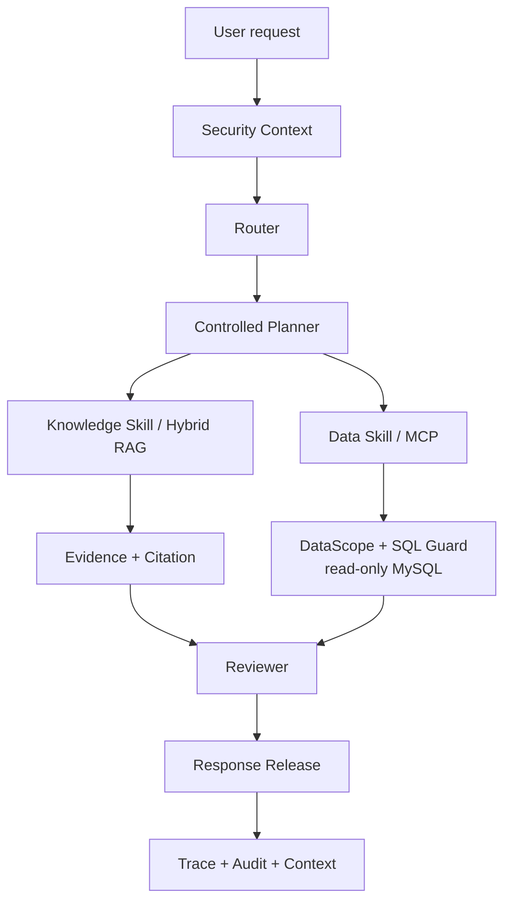

# Enterprise Decision Agent

> **Controlled Knowledge + Data AI Agent Platform**

[](https://github.com/ccy777/enterprise-decision-agent/actions/workflows/ci.yml)


An evidence-first AI Agent platform that routes enterprise questions across hybrid RAG and read-only data tools, then releases answers only after scope, evidence, citation, and reviewer checks.

面向企业知识问答、经营数据分析与综合决策场景的受控 AI Agent 平台，统一编排 Agentic RAG、MCP Data Agent、Context / Memory 与结果审查。

## Highlights

- Controlled `Router -> Planner -> Skill -> Reviewer -> Release` workflow instead of unrestricted tool calling.
- Knowledge, Data, and Mixed task routing for policy questions, read-only analysis, and evidence-backed recommendations.
- Hybrid RAG: Dense + BM25 -> RRF -> Cross-Encoder -> Parent Expansion.
- MCP-based, read-only enterprise data access with DataScope, safe projection, SQL validation, limits, and timeouts.
- Evidence selection, answerability checks, and citation validation before response release.
- SecurityContext and scope boundaries that fail closed when required authorization is absent.
- Frozen / adopted 200-query Retrieval Benchmark v2 with independently reproducible ranking evidence.
- CI-gated quality, tests, security evaluation, secret scanning, dependency scanning, and offline integration.

## Why this is not a normal RAG demo

| Path | What the Agent does | Control boundary |
| --- | --- | --- |
| **Knowledge** | Hybrid retrieval, evidence selection, answerability and citations | KnowledgeScope and evidence review |
| **Data** | MCP tool invocation and read-only business-data analysis | DataScope, SQLGlot validation, safe projection, SQL Guard |
| **Mixed** | Combines policy evidence with business facts for a decision | Reviewer checks evidence sufficiency before controlled release |

The design is therefore more than `Question -> Vector DB -> LLM`: each answer has an explicit route, authorized capability, evidence basis, review step, and release decision.

## Architecture



The public architecture intentionally presents the control chain rather than internal provider-stage or deployment details. See [Architecture](docs/ARCHITECTURE.md) and [Agent Workflow](docs/AGENT_WORKFLOW.md) for the design.


> The built-in FastAPI Demo UI shows runtime readiness, answers, citations, route, selected skill, memory state, and execution trace. The screenshot intentionally shows an unready runtime without a configured Provider; the system fails closed instead of fabricating a ready state.

## Core Features

### 1. Controlled Agent Workflow

LangGraph coordinates explicit Router, Planner, Skill, Reviewer, and Release stages. A plan cannot create privileges, expand Scope, or bypass registered tools and skills. This is controlled execution, not arbitrary agent-to-tool access.

### 2. Agentic RAG

```text
Dense + BM25 -> RRF -> Cross-Encoder -> Parent Expansion
                              -> Evidence Selection -> Citation
```

The retrieval path combines semantic and lexical recall, reranks fused candidates, expands relevant parent context, and separates candidate evidence from release-ready citations. It supports answerability review rather than claiming to eliminate hallucinations. See [Hybrid RAG](docs/HYBRID_RAG.md).

### 3. MCP Data Agent

Data requests cross an MCP tool boundary and are constrained by read-only SQL, table/column allowlists, `LIMIT` and timeout checks, DataScope, and safe data projection. The model receives only fields permitted for the request. See [Data Agent & MCP](docs/DATA_AGENT_AND_MCP.md).

### 4. Context / Memory

Context and memory are bounded and isolated by tenant, user, and session. The runtime supports in-memory or Redis-backed state, TTL, state versioning, rolling summaries, and bounded context rather than unbounded conversation accumulation.

### 5. Security & Review

SecurityContext and scope checks are applied across request, workflow, skill, tool, data, knowledge, and response-release boundaries. Missing authorization fails closed. Evidence validation, reviewer checks, release gating, and a locally verifiable audit hash chain make the decision path inspectable. See [Security Boundaries](docs/SECURITY_BOUNDARIES.md).

## Retrieval Benchmark v2

**Status: FROZEN / ADOPTED.** Retrieval Benchmark v2 is the current public benchmark for this project.

| Composition | Value |
| --- | ---: |
| Queries | 200 |
| Answerable / Unanswerable | 160 / 40 |
| Enterprise documents | 12 |
| Parent records | 36 |
| Child evidence windows | 101 |

Ranking metrics use **160 Answerable queries** as the denominator. The 40 Unanswerable queries are deliberately excluded from Hit@K and MRR denominators.

| Metric | RRF | Cross-Encoder Reranker | Gain |
| --- | ---: | ---: | ---: |
| Child Hit@1 | 85.62% | 96.25% | +10.63pp |
| Hit@5 | 100.00% | 100.00% | — |
| MRR@5 | 91.69% | 98.12% | +6.44pp |

The relevance freeze distinguishes single-window answer sufficiency from multi-evidence retrieval relevance. Cross-Encoder reranking substantially improves top-ranked evidence relevance; however, multi-evidence evaluation also reveals a real precision–coverage trade-off: concentrating Top-K on the most similar evidence can reduce evidence diversity and full evidence coverage. It is not accurate to claim that reranking improves every retrieval objective.

### Historical v1 Baseline

The former 50-query result is preserved as a **Historical Baseline**, not the current benchmark: 46 Answerable / 4 Unanswerable queries, RRF Child Hit@1 **84.78%**, and Cross-Encoder Child Hit@1 **93.48%**. Retrieval Benchmark v2 above is the current reference.

> These results are from a frozen synthetic-enterprise benchmark. They are not production accuracy, a production SLA, universal real-world performance, or a claim of 100% retrieval quality beyond this benchmark.

## Engineering Quality

The repository emphasizes verifiable engineering evidence rather than a changing test-count headline.

- GitHub Actions gates every pull request with `quality`, `unit`, `security-evaluation`, `secret-scan`, `dependency-scan`, and `offline-integration`.
- Offline verification and selected tests do not require a Provider, external database, or network service.
- Retrieval evidence is checked by a committed verifier instead of rerunning a costly model evaluation.
- Dependency scanning is enforced in CI; vulnerabilities are blocked before merge rather than documented after release.
- Secret scanning and fail-closed security evaluation are first-class delivery gates.

## Demo / Run

### Quick Verify — no Provider required

Install the locked environment and run the repository's committed retrieval-evidence verifier. This checks public-safe committed evidence and does not invoke a Provider.

```powershell
python -m venv .venv
.\.venv\Scripts\python.exe -m pip install -r requirements.lock
.\.venv\Scripts\python.exe -m pip install -e . --no-deps
.\.venv\Scripts\python.exe scripts\verify_retrieval_evidence.py
```

### Full Demo — bring your own local configuration

Follow [Local Demo](docs/LOCAL_DEMO.md) and the field descriptions in [`.env.example`](.env.example) to configure your own compatible Provider and local infrastructure. The repository contains no usable credentials, model weights, database volume, or runtime audit log.

```powershell
docker compose config
docker compose up -d

.\.venv\Scripts\python.exe scripts\run_local_demo.py knowledge
.\.venv\Scripts\python.exe scripts\run_local_demo.py data
.\.venv\Scripts\python.exe scripts\run_local_demo.py mixed
```

The three modes demonstrate Knowledge, Data, and Mixed paths. Provider calls may incur cost; use the local demo guide for prerequisites and shutdown steps. To view the UI, run:

```powershell
.\.venv\Scripts\python.exe -m uvicorn decision_agent.main:app --host 127.0.0.1 --port 8000
```

Then open `http://127.0.0.1:8000`.

## Project Structure

```text
src/decision_agent/   Agent runtime, security, retrieval, MCP, API, and skills
tests/                Unit and offline integration tests
scripts/              Demo and committed verification entry points
datasets/             Sanitized synthetic knowledge, data, and security fixtures
docs/                 Public architecture, workflow, security, and demo guides
.github/              CI and dependency automation
```

## Documentation

| Document | Purpose |
| --- | --- |
| [Architecture](docs/ARCHITECTURE.md) | System layers and end-to-end request flow |
| [Agent Workflow](docs/AGENT_WORKFLOW.md) | Router, Planner, Skills, Reviewer, and release controls |
| [Hybrid RAG](docs/HYBRID_RAG.md) | Retrieval, fusion, reranking, parent expansion, and evidence selection |
| [Data Agent & MCP](docs/DATA_AGENT_AND_MCP.md) | MCP, DataScope, SQL Guard, and read-only data access |
| [Security Boundaries](docs/SECURITY_BOUNDARIES.md) | Identity, authorization, scope, provider, and audit boundaries |
| [Local Demo](docs/LOCAL_DEMO.md) | Local prerequisites and Knowledge / Data / Mixed walkthroughs |
| [Limitations](docs/LIMITATIONS.md) | Known constraints and engineering boundaries |

## Scope and Limitations

This is a controlled engineering system, not a claim of unrestricted autonomy, zero hallucinations, or production-scale guarantees. Public documentation exposes architecture, sanitized demonstrations, benchmark composition, and verified metrics; it does not expose credentials, private configurations, raw benchmark artifacts, original query sets, internal adjudications, runtime logs, or internal filesystem paths.

The repository has no project-wide open-source license. Public visibility does not itself grant permission to copy, modify, or redistribute the code.
