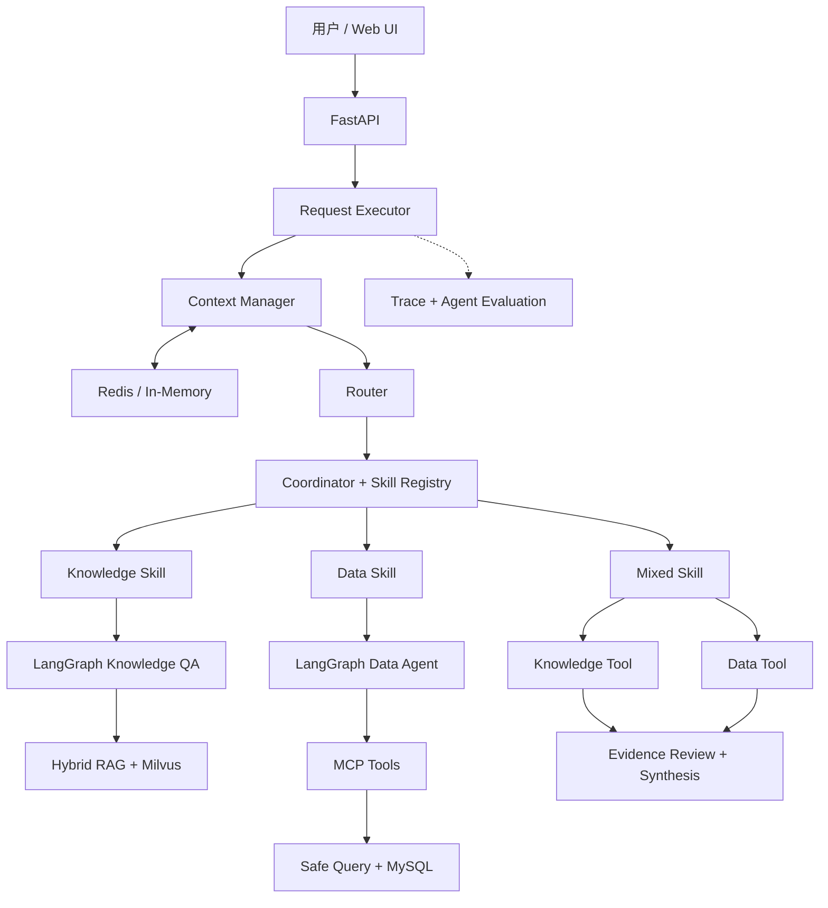

# 整体架构

Enterprise Decision Agent 由 FastAPI、Context Manager、Router、Coordinator、Skill、Knowledge / Data Tool、Reviewer 与 Trace 等模块组成。

## 核心模块职责

| 模块 | 主要职责 |
| --- | --- |
| FastAPI | 提供健康检查、就绪检查和 Agent 执行接口 |
| FormalRequestExecutor | 组织一次完整请求，串联上下文、路由、执行、审查和响应 |
| Router | 判断 Knowledge、Data 或 Mixed 任务 |
| Coordinator / Skill Registry | 根据路由选择已注册 Skill |
| Native Tool Calling | 选择并调用 Knowledge Agent 或 Data Agent 工具 |
| Reviewer | 检查执行结果、Evidence 和 Citation |
| Context / Memory | 装配当前请求与历史会话信息 |
| 链路追踪 / 离线评测 | 记录执行阶段并支持离线回归 |

## 知识问答链路

Knowledge 链路加载版本化 Parent / Child 分块，同时执行 Dense 与 BM25 检索，使用 RRF 融合结果，再通过 Cross-Encoder 精排和 Parent Expansion 补充上下文。随后完成 Evidence Selection、Answerability Review、答案生成和 Citation 校验。

## 数据分析链路

Data 链路通过 Native Tool Calling 进入 Data Agent。Data Agent 先从 MCP 获取 Schema 和业务定义，由 Data Planner 生成结构化 SQL 计划，再调用 MCP 查询 MySQL 并生成带数据引用的分析结果。

## 联合决策链路

Mixed 链路分别执行 Knowledge 与 Data 子任务，将知识规则和经营数据组合为同一份库存风险诊断结果，并由 Reviewer 完成最终检查。

## 运行时资源

MySQL、Milvus、Redis和MCP客户端在应用启动阶段统一创建，并在应用关闭时释放。默认测试使用可重复的本地替代实现，真实服务通过Docker与本地配置接入。
