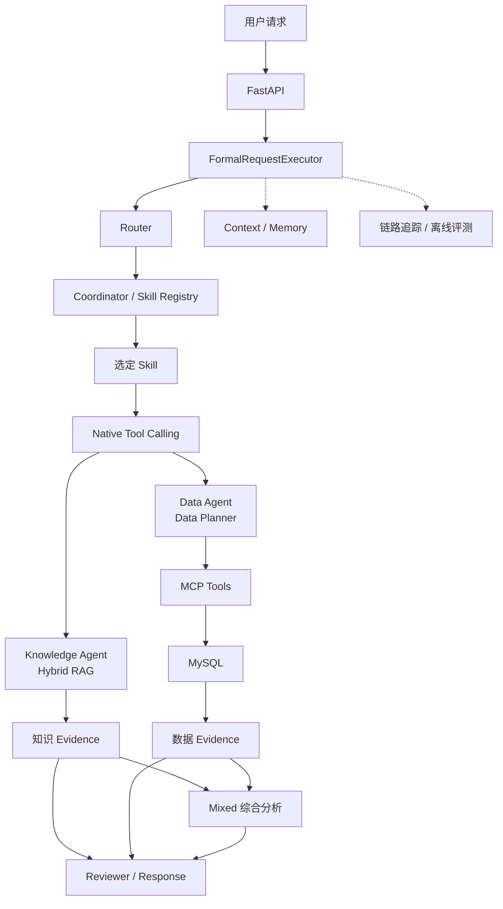

# 整体架构

Enterprise Decision Agent由FastAPI、请求执行器、Router、Coordinator、Skill、Tool、知识检索、数据查询、Reviewer以及Trace等模块组成。

## 核心模块职责

| 模块 | 主要职责 |
| --- | --- |
| FastAPI | 提供健康检查、就绪检查和Agent执行接口 |
| FormalRequestExecutor | 组织一次完整请求，串联上下文、路由、执行、审查和响应 |
| Router | 判断Knowledge、Data或Mixed任务 |
| Coordinator / Skill Registry | 根据路由选择已注册Skill |
| Native Tool Calling | 选择并调用Knowledge Agent或Data Agent工具 |
| Reviewer | 检查执行结果、Evidence和Citation |
| Context / Memory | 装配当前请求与历史会话信息 |
| 链路追踪 / 离线评测 | 记录执行阶段并支持离线回归 |

## 知识问答链路

Knowledge链路加载版本化Parent/Child分块，同时执行Dense与BM25检索，使用RRF融合结果，再通过Cross-Encoder精排和Parent Expansion补充上下文。随后完成Evidence Selection、Answerability Review、答案生成和Citation校验。

## 数据分析链路

Data链路通过Native Tool Calling进入Data Agent。Data Agent先从MCP获取Schema和业务定义，由Data Planner生成结构化SQL计划，再调用MCP查询MySQL并生成带数据引用的分析结果。

## 联合决策链路

Mixed链路分别执行Knowledge与Data子任务，将知识规则和经营数据组合为同一份库存风险诊断结果，并由Reviewer完成最终检查。

## 运行时资源

MySQL、Milvus、Redis和MCP客户端在应用启动阶段统一创建，并在应用关闭时释放。默认测试使用可重复的本地替代实现，真实服务通过Docker与本地配置接入。
